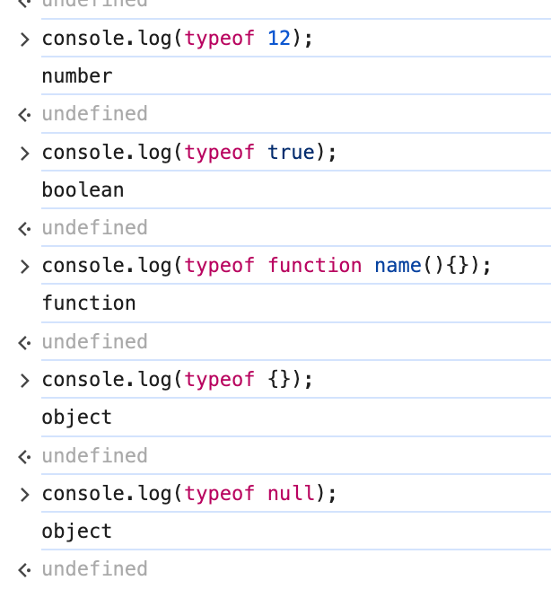

# 数据类型

在 ECMAScript5 中有五种基本类型`Number`、`String`、`Boolean`、`Null`、`Undefined`，还有一种引用类型`Object`组成（Object 本质由一组无序的键值对组成）

## typeof 操作符

typeof 是用来检测 ECMAScript 的变量类型的，检测类型返回值关系如下：
| 数据类型 | 说明 |
| ----------- | ----------------------- |
| "undefined" | 如果这个值未定义 |
| "boolean" | 如果这个值是布尔值 |
| "string" | 如果这个值是字符串 |
| "number" | 如果这个值是数值 |
| "object" | 如果这个值是对象或 null |
| "function" | 如果这个值是函数 |

```js
var name = 'zhangsan';
console.log(typeof name); // string
console.log(typeof(name)); // string typeof是操作符而不是内置函数，所以括号可加可不加

console.log(typeof 12); // number
console.log(typeof true); // boolean
console.log(typeof ()=>{}); // function
console.log(typeof {}); // object

var noValue; // 只声明不赋值会有默认值undefined
console.log(typeof noValue); // undefined

var nullValue = null;
console.log(typeof nullValue);//object 因为特殊值 null 被认为是一个空的对象引用

```



## undefined 类型

## Null 类型

## Boolean 类型

## Number 类型

## String 类型

## Object 类型
