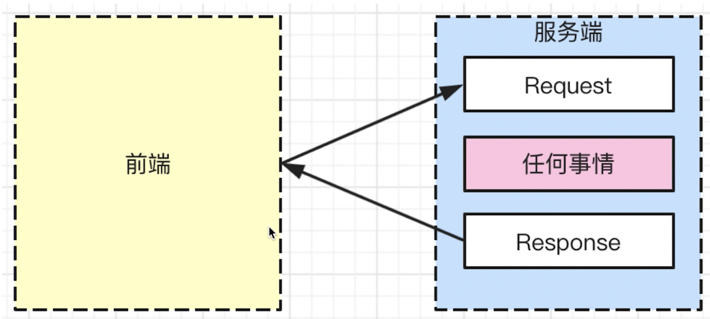
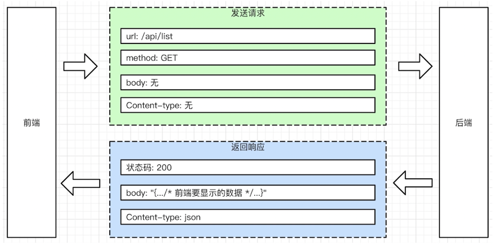
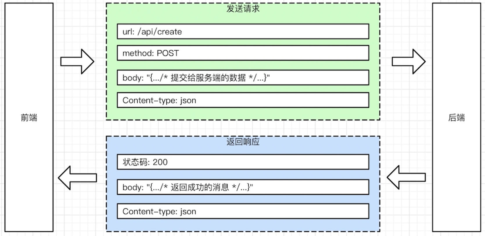

## 服务端处理 Request Response



## nodes 启动 Web 服务

- 使用http模块启动服务
- 本地服务IP为 127.0.0.1:xxxx 域名：localhost:xxxx

``````javascript
const http = require('http');
// require 三个层级 1.系统自带模块 2.npm包模块 3.自定义模块
const server = http.createServer(()=>{
  console.log('收到http请求');
}); // 创建http服务
server.listen(3000); //监听请求，3000 端口
console.log('端口已被监听');
``````


## req 和 res

`req`即`Request`，`res`即`Response`，是请求http的关键

### 如何拿到 req 和 res

```javascript
const server = http.createServer((req,res)=>{
  console.log(req,'req');
  console.log(res,'res');
  res.end('hello'); // res返回信息给前端
}); // 创建http服务
```


## 路由

### 路由包含什么

- 定义 method ， 如GET/POST
- 定义 url 规则，如 /api/list
- 定义 输入（request body）和输出（Response body）格式

路由（router）是服务端的入口规则，与后端接口做交互使用的





### node 定义路由

- 从req中获取url与method，并判断是否符合规则

## queryString

又叫url参数，url ?后面的都是，以&分割，key=value形式书写

### 作用

- 动态网页的基石

## 使用res返回数据

- 设置返回的状态码，Content-type,Body

### 返回JSON数据

```javascript
http.createServer((req,res)=>{
  const url = req.url;
  const path = url.split("?")[0];
  const method = req.method;
  if(path == '/api/create' && method == 'POST'){
    res.writeHead(200,{'Content-type':'appliction/json'});
    res.end(JSON.stringify({
      errorNo:0,
      msg:'创建成功'
    }))
    return;
  }
  res.writeHead(404,{'Content-type','text/plain'});
  res.end('404 not found')
})
```

### 返回html数据

- 使用 Content-type: text/html
- res.end设置body
- 浏览器会根据Content-type识别出html

```javascript
		res.writeHead(404, { "Content-type": "text/html" });
    res.end(`
      <!DOCTYPE html>
      <html>
        <head>
            <title>找不到此页面/(ㄒoㄒ)/~~</title>
        </head>
        <body>
          <div class="notfoud-container">
              </div>
              <p class="notfound-p">哎呀迷路了...</p>
              <div class="notfound-reason">
                  <p>可能的原因：</p>
                  <ul>
                      <li>原来的页面不存在了</li>
                      <li>我们的服务器被外星人劫持了</li>
                  </ul>
              </div>
              <div class="notfound-btn-container">
                  <a class="notfound-btn" href="/">返回首页</a>
              </div>
          </div>
        </body>
      </html>
      `);
```

## 流

流的表现特征：

- 观看视频时，一边加载一边观看
- 上传文件时，有进度条
- 网速较慢时，打开网页会先显示一部分，然后继续加载

浏览器接收 流（stream）数据 过程

- 服务端 res.end(...) , 会自动以流的形式返回
- 浏览器会识别到 流 ， 并持续接收信息（会有进度条）

### 上传

客户端传到服务端，通过网络进行上传数据

上传不仅指大文件，他泛指所有的Request Body

## 接收

前端使用Ajax提交数据 Request Body

服务端需要识别 流，并接受数据

要知道何时才能接受完成

## 获取Request Body

```javascript
    console.log("req content-type", req.headers["content-type"]);
    const reqType = req.headers["content-type"];

    let bodyStr = "";
    req.on("data", (chunk) => {
      bodyStr = bodyStr + chunk.toString();
    });
    req.on("end", () => {
      if (reqType === "application/json") {
        console.log("bodyStr is", JSON.parse(bodyStr));
        res.end("接收成功");
      }
    });
```

